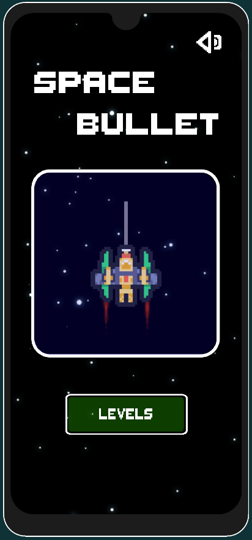
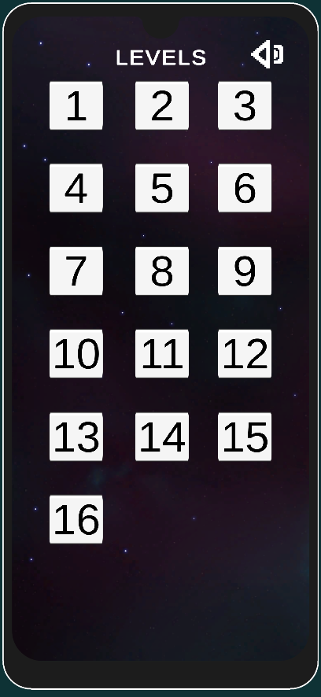
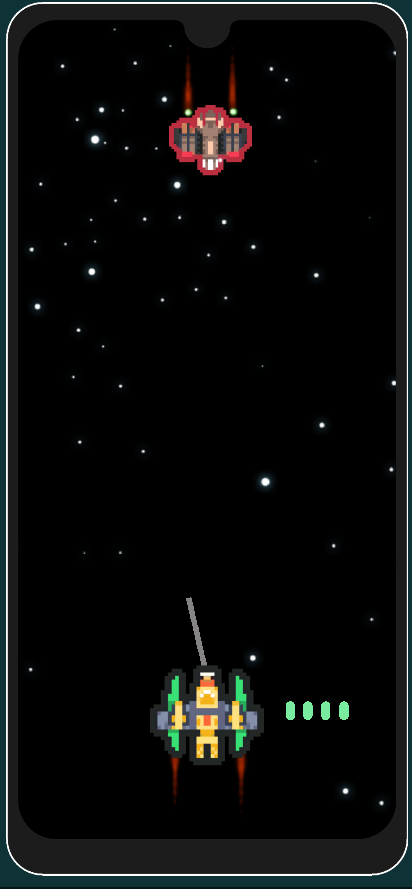

# SpaceBullet

## Project Description
You are the operator of a spaceship traveling through space,and in each level, you face different enemy spaceships withdifferent behaviors. You have a limited number of bullets to tryto hit and destroy all the enemy ships to pass the level

# VIDEO

https://github.com/MuhammetMelihKIR/SpaceBullet/assets/120091310/722b75fb-8bd6-4f6d-93f7-94d8099ce968

## Game Screen

 <a href="https://www.w3schools.com/cs/" target="_blank" rel="noreferrer"> 

